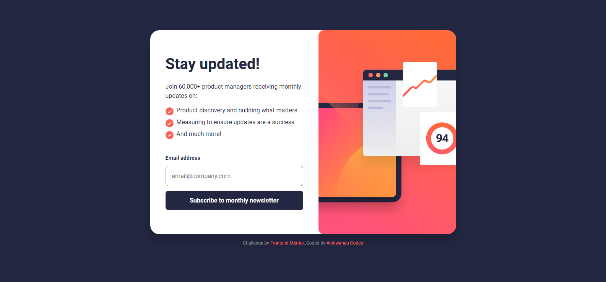
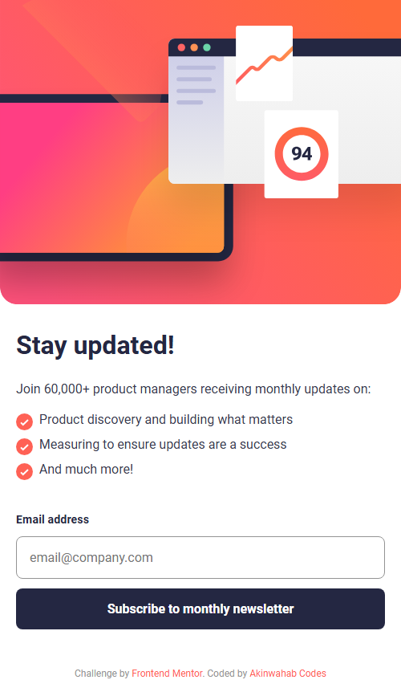
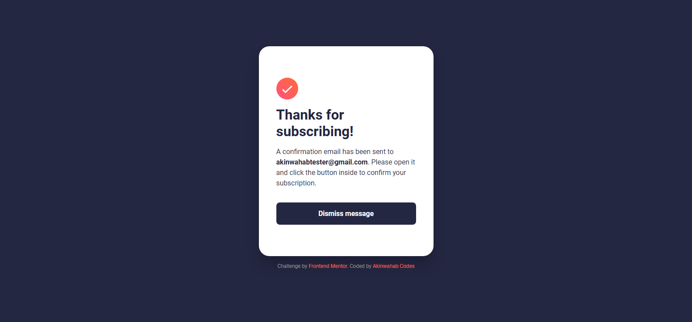
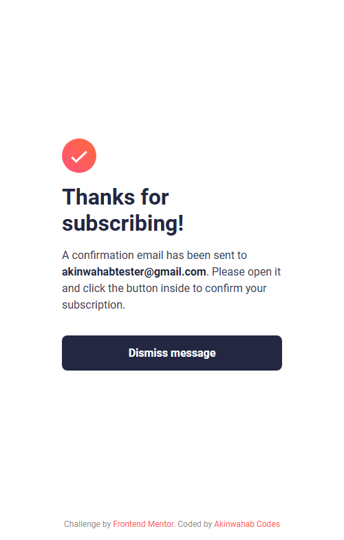

# Frontend Mentor - Newsletter Sign-up Form with Success Message Solution

This is a solution to the [Newsletter sign-up form with success message challenge on Frontend Mentor](https://www.frontendmentor.io/challenges/newsletter-signup-form-with-success-message-3FC1AZbNrv).  


---

## Table of contents

- [Overview](#overview)
  - [The challenge](#the-challenge)
  - [Screenshot](#screenshot)
  - [Links](#links)
- [My process](#my-process)
  - [Built with](#built-with)
  - [What I learned](#what-i-learned)
  - [Continued development](#continued-development)
- [Author](#author)

---

## Overview

### The challenge

Users should be able to:

- Add their email and submit the form  
- See a success message with their email after successfully submitting the form  
- See validation messages if:
  - The field is empty  
  - The email format is invalid  
- View an optimal layout for their device’s screen size  
- See hover and focus states for all interactive elements  

---

### Screenshot

| Desktop View | Mobile View |
|---------------|--------------|
|  |  |

| Sucess Desktop View | Sucess Mobile View |
|---------------|--------------|

|  |  |

Erorr state

---

### Links

- Solution URL: [Find the solution here](https://github.com/Akinwahab/Frontend_Mentor_Challenges/tree/main/Newsletter-signup-page)
- Live Site URL: [Visit the live site URL here](https://akinwahab.github.io/Frontend_Mentor_Challenges/Newsletter-signup-page/)

---

## My process

### Built with

- **Semantic HTML5 markup**  
- **CSS custom properties**  
- **Flexbox & CSS Grid**  
- **Responsive design (Mobile-first approach)**  
- **Vanilla JavaScript**


---

### What I learned

This challenge helped me strengthen my understanding of **form validation**, **DOM manipulation**, and **responsive design**.  
Here’s an example of the validation logic that switches views when the email input is valid:

```js
form.addEventListener("submit", (e) => {
  e.preventDefault();
  const emailValue = emailInput.value.trim();

  if (!validateEmail(emailValue)) {
    errorText.textContent = "Valid email required";
    emailInput.classList.add("error");
  } else {
    signUpSection.style.display = "none";
    successSection.classList.remove("hidden");
    container.style.maxWidth = "600px";
  }
});
```

### Continued Development
In future projects, I want to:
- Use CSS animations for smoother transitions between states
- Integrate it into Real life websites 
- Add third party validation
```

### Useful Resources
- [MDN Web Docs](https://developer.mozilla.org/)
```

## Author

- GitHub - [akinwahab](https://github.com/akinwahab)
- Website - [Akinwahab Codes](https://akinwahab.netlify.app)
- Frontend Mentor - [@akinwahab](https://www.frontendmentor.io/profile/akinwahab)
- YouTube - [Akinwahab Codes](https://www.youtube.com/@Akinwahab099)
