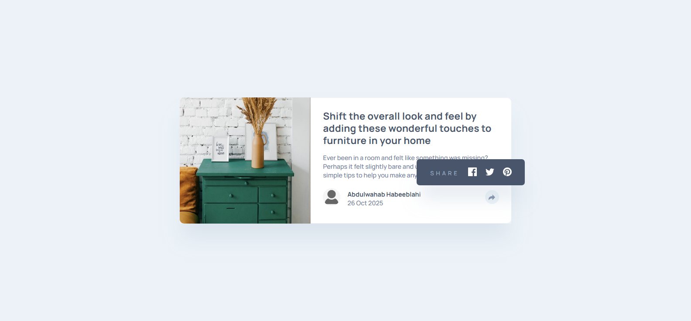
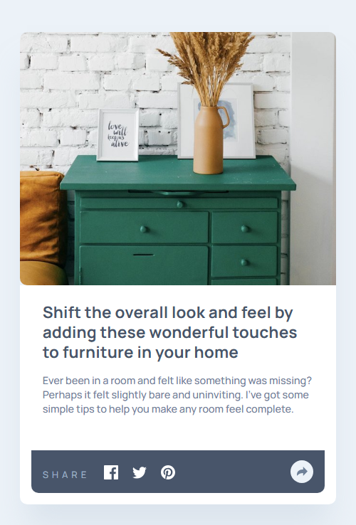

# Frontend Mentor - Article Preview Component Solution

This is a solution to the [Article Preview Component challenge on Frontend Mentor](https://www.frontendmentor.io/challenges/article-preview-component-dYBN_pYFT).
---

## Table of Contents

- [Overview](#-overview)
  - [The Challenge](#-the-challenge)
  - [Screenshot](#-screenshot)
  - [Links](#-links)
- [My Process](#-my-process)
  - [Built With](#-built-with)
  - [What I Learned](#-what-i-learned)
  - [Continued Development](#-continued-development)
  - [Useful Resources](#-useful-resources)
- [Author](#-author)
- [Acknowledgments](#-acknowledgments)

---

##  Overview

### The Challenge

Users should be able to:

- View the optimal layout for the component depending on their device's screen size.
- See the social media share links when they click the share icon.

###  Screenshot




### Links

- Solution URL: [Find the solution here](https://github.com/Akinwahab/Frontend_Mentor_Challenges/tree/main/article-preview-component-master)
- Live Site URL: [Visit the live site URL here](https://akinwahab.github.io/Frontend_Mentor_Challenges/article-preview-component-master/)

---

## My Process

### ⚙️ Built With

- Semantic **HTML5** markup
- **CSS custom properties (:root variables)**
- **Flexbox** for layout
- **Media Queries** for responsiveness
- **Vanilla JavaScript** for interactivity
- Clean, consistent **BEM-style naming convention**

### What I Learned

This project helped strengthen my understanding of:

- Responsive layouts using **flexbox** and **media queries**.
- Writing clean, scalable CSS with **variables** for color and spacing.
- Toggling visibility and switching UI states dynamically with **JavaScript**.

Example snippet from the share toggle logic:

```js
const desktopShareBtn = document.getElementById('desktop-share-btn');
const shareContainer = document.querySelector('.share__container');

desktopShareBtn.addEventListener('click', () => {
  shareContainer.classList.toggle('hidden');
});
```

### Continued Development

I want to keep improving my:
- CSS layout mastery (especially Grid and flex combinations).
- JavaScript event handling for responsive UIs.
- Structuring reusable and scalable component-based CSS.

### 📚 Useful Resources

- [CSS Tricks: Flexbox Guide](https://css-tricks.com/snippets/css/a-guide-to-flexbox/) – Excellent resource for mastering Flexbox.
- [MDN Web Docs](https://developer.mozilla.org/) – For deep dives into HTML, CSS, and JS fundamentals.

---

## 👨‍💻 Author

- GitHub - [akinwahab](https://github.com/akinwahab)
- Website - [Akinwahab Codes](https://akinwahab.netlify.app)
- Frontend Mentor - [@akinwahab](https://www.frontendmentor.io/profile/akinwahab)
- YouTube - [Akinwahab Codes](https://www.youtube.com/@Akinwahab099)

---