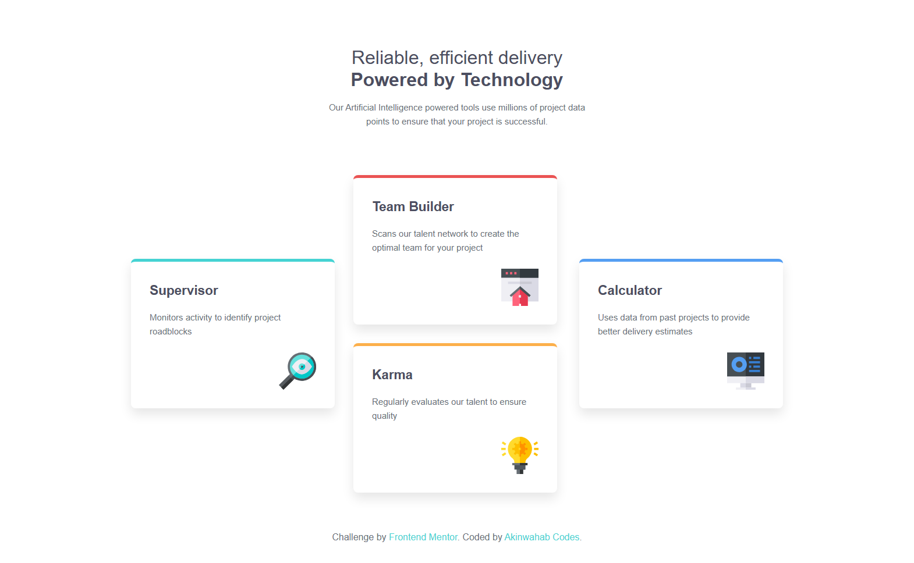

# Frontend Mentor - Four card feature section solution

This is a solution to the [Four card feature section challenge on Frontend Mentor](https://www.frontendmentor.io/challenges/four-card-feature-section-weK1eFYK).
## Table of contents

- [Overview](#overview)
  - [The challenge](#the-challenge)
  - [Screenshot](#screenshot)
  - [Links](#links)
- [My process](#my-process)
  - [Built with](#built-with)
  - [What I learned](#what-i-learned)
  - [Continued development](#continued-development)
  - [Useful resources](#useful-resources)
- [Author](#author)


## Overview

### The challenge

Users should be able to:

- View the optimal layout for the site depending on their device's screen size

### Screenshot




### Links

- Solution URL: [Find the solution here](https://github.com/Akinwahab/Frontend_Mentor_Challenges/tree/main/four-card-feature)
- Live Site URL: [Visit the live site URL here](https://akinwahab.github.io/Frontend_Mentor_Challenges/four-card-feature/)


---

## My process

### Built with

- Semantic **HTML5 markup**
- **CSS custom properties**
- **Flexbox** for layout
- **Mobile-first workflow**

### What I learned

This project helped me practice **responsive layouts with Flexbox**.
Here’s a small CSS snippet I’m proud of:

```css
.cards {
  display: flex;
  justify-content: center;
  align-items: center;
  gap: 2rem;
  flex-wrap: wrap;
}

.card-group {
  display: flex;
  flex-direction: column;
  gap: 2rem;
  flex: 1;
}
```

### Continued development

In the future, I’d like to:

* Explore adding animations or transitions for smoother hover effects.

### Useful resources

* [CSS Tricks: A Complete Guide to Flexbox](https://css-tricks.com/snippets/css/a-guide-to-flexbox/) – Super useful guide while structuring the layout.
* [MDN Web Docs](https://developer.mozilla.org/).

---

## Author

- GitHub - [akinwahab](https://github.com/akinwahab)
- Website - [Akinwahab Codes](https://akinwahab.netlify.app)
- Frontend Mentor - [@akinwahab](https://www.frontendmentor.io/profile/akinwahab)
- YouTube - [Akinwahab Codes](https://www.youtube.com/@Akinwahab099)

---
