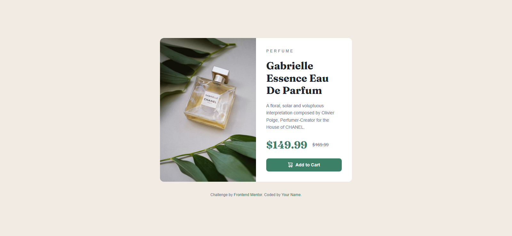
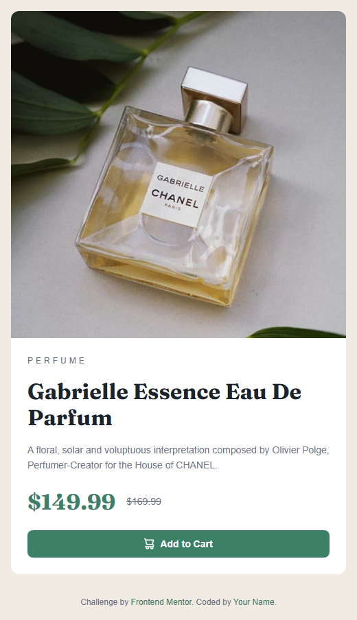

# Frontend Mentor - Product Preview Card solution

This is a solution to the [Product Preview Card challenge on Frontend Mentor](https://www.frontendmentor.io/challenges/product-preview-card-component-GO7UmttRfa).  
Frontend Mentor challenges help you improve your coding skills by building realistic projects.

---

## Table of contents

- [Overview](#overview)
  - [The challenge](#the-challenge)
  - [Screenshot](#screenshot)
  - [Links](#links)
- [My process](#my-process)
  - [Built with](#built-with)
  - [What I learned](#what-i-learned)
  - [Continued development](#continued-development)
  - [Useful resources](#useful-resources)
- [Author](#author)
- [Acknowledgments](#acknowledgments)

---

## Overview

### The challenge

Users should be able to:

- View the optimal layout depending on their device’s screen size
- See hover and focus states for interactive elements

### Screenshot

## Desktop


##Mobile



### Links

- Solution URL: [Find the solution here](https://github.com/Akinwahab/Frontend_Mentor_Challenges/tree/main/product-preview-card)
- Live Site URL: [Visit the live site URL here](https://akinwahab.github.io/Frontend_Mentor_Challenges/product-preview-card/)


---

## My process

### Built with

- Semantic HTML5 markup
- CSS custom properties
- Mobile-first workflow
- CSS Grid and Flexbox
- [Google Fonts - Montserrat](https://fonts.google.com/specimen/Montserrat)
- [Google Fonts - Fraunces](https://fonts.google.com/specimen/Fraunces)

### What I learned

This project helped me practice **responsive layouts** and combining **grid + flexbox** effectively.  
I also got comfortable using **CSS variables** for colors and typography.

Example of code I’m proud of:

```css
.card {
  background: var(--clr-white);
  border-radius: 0.75rem;
  overflow: hidden;
  max-width: 600px;
  display: grid;
  grid-template-columns: 1fr;
}

@media (min-width: 600px) {
  .card {
    grid-template-columns: 1fr 1fr;
  }
}

### Continued development

I want to continue focusing on:
- Improving my **responsive design skills** for different screen sizes.
- Keeping HTML clean and senematic.
- Writing cleaner and reusable CSS components.
- Exploring CSS clamp() for responsive font sizes.

### Useful resources

- [MDN Web Docs](https://developer.mozilla.org/) - Comprehensive reference for HTML, CSS, and JavaScript.
- [Kevin Powell - CSS Tips on YouTube](https://www.youtube.com/kepowob) - His videos on responsive design were super helpful for this challenge.

## Author

- GitHub - [akinwahab](https://github.com/akinwahab)
- Website - [Akinwahab Codes](https://akinwahab.netlify.app)
- Frontend Mentor - [@akinwahab](https://www.frontendmentor.io/profile/akinwahab)
- YouTube - [Akinwahab Codes](https://www.youtube.com/@Akinwahab099)
