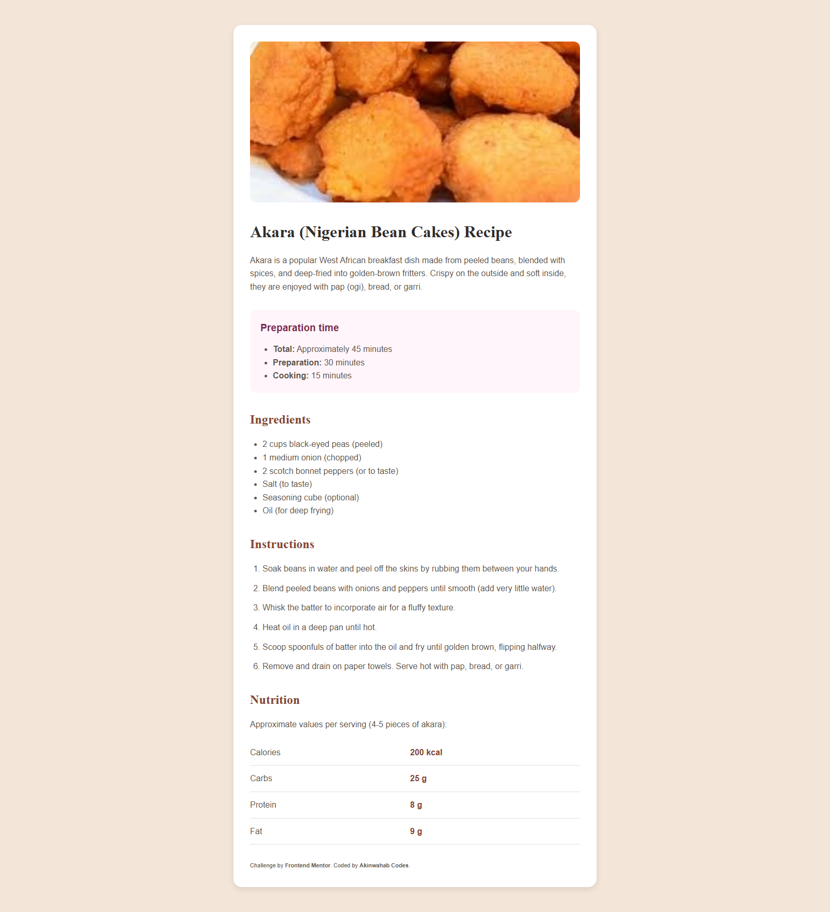

# Akara Recipe Page

This is my solution to the [Recipe page challenge on Frontend Mentor](https://www.frontendmentor.io/challenges/recipe-page-KiTsR8QQKm).
I customized it to showcase **Akara (bean cakes)**, a popular West African dish.

## Table of contents

* [Overview](#overview)

  * [The challenge](#the-challenge)
  * [Screenshot](#screenshot)
  * [Links](#links)
* [My process](#my-process)

  * [Built with](#built-with)
  * [What I learned](#what-i-learned)
  * [Continued development](#continued-development)
  * [Useful resources](#useful-resources)
* [Author](#author)

## Overview

### The challenge

The goal was to build a recipe page where users can:

* View the page across different screen sizes
* Read the recipe clearly with proper typography and layout

### Screenshot



*Akara recipe page screenshot*

### Links

* Solution URL: [Frontend Mentor Solution](https://github.com/Akinwahab/Frontend_Mentor_Challenges/tree/main/recipe-page)
* Live Site URL: [Live Demo](https://akinwahab.github.io/Frontend_Mentor_Challenges/recipe-page/)

## My process

### Built with

* Semantic **HTML5** markup
* **CSS custom properties** for colors and typography
* **Flexbox** and **CSS Grid** for layout
* **Mobile-first workflow**

### What I learned

This project helped me practice combining semantic HTML with clean design.
I specifically learned how to:

* Keep typography readable on both mobile and desktop

Example code I’m proud of:

```css
.recipe__nutrition table {
  width: 100%;
  border-collapse: collapse;
}

```

### Continued development

In future projects, I want to:

* Improve **accessibility**. 
* Experiment with **CSS clamp()** for fluid typography
* Practicing with more advanced responsive layouts

### Useful resources

* [MDN](https://developer.mozilla.org/en-US/docs)
* [CSS Tricks - Flexbox Guide](https://css-tricks.com/snippets/css/a-guide-to-flexbox/)

## Author

- GitHub - [akinwahab](https://github.com/akinwahab)
- Website - [Akinwahab Codes](https://akinwahab.netlify.app)
- Frontend Mentor - [@akinwahab](https://www.frontendmentor.io/profile/akinwahab)
- YouTube - [Akinwahab Codes](https://www.youtube.com/@Akinwahab099)

---