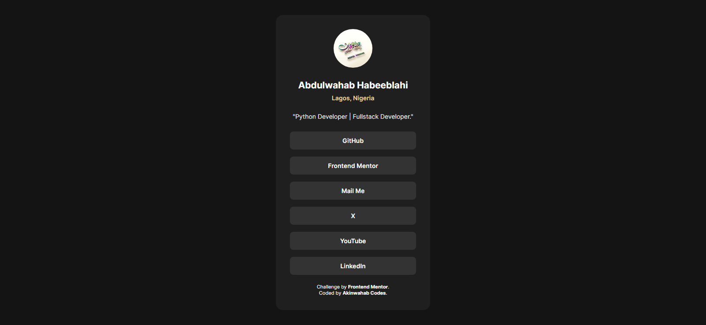

# Frontend Mentor - Social links profile solution

This is a solution to the [Social links profile challenge on Frontend Mentor](https://www.frontendmentor.io/challenges/social-links-profile-UG32l9m6dQ).

## Table of contents

* [Overview](#overview)

  * [The challenge](#the-challenge)
  * [Screenshot](#screenshot)
  * [Links](#links)
* [My process](#my-process)

  * [Built with](#built-with)
  * [What I learned](#what-i-learned)
  * [Continued development](#continued-development)
  * [Useful resources](#useful-resources)
* [Author](#author)

---

## Overview

### The challenge

Users should be able to:

* See hover and focus states for all interactive elements on the page
* Access links that open safely in new tabs

### Screenshot



### Links

- Solution URL: [Find the solution here](https://github.com/Akinwahab/Frontend_Mentor_Challenges/tree/main/social-profile)
- Live Site URL: [Visit the live site URL here](https://akinwahab.github.io/Frontend_Mentor_Challenges/social-profile/)


---

## My process

### Built with

* Semantic **HTML5** markup
* **CSS custom properties**
* **Flexbox** for layout
* **Mobile-first workflow**

### What I learned

Working on this challenge reinforced how important **accessible links** and **hover states** are for user experience.

For example, I used `rel="noopener noreferrer"` along with `target="_blank"` for security:

```html
<a href="https://x.com/akinwahabcodes" target="_blank" rel="noopener noreferrer">X</a>
```

### Continued development

In the future, I’d like to:

* Explore adding animations or transitions for smoother hover effects.
* Make the card more dynamic.

### Useful resources

* [MDN: target & rel attributes](https://developer.mozilla.org/en-US/docs/Web/HTML/Element/a#attr-rel) – helped me understand why `noopener noreferrer` is important.
* [CSS Tricks: Centering in CSS](https://css-tricks.com/centering-css-complete-guide/) – super useful for flexbox alignment.

---

## Author

- GitHub - [akinwahab](https://github.com/akinwahab)
- Website - [Akinwahab Codes](https://akinwahab.netlify.app)
- Frontend Mentor - [@akinwahab](https://www.frontendmentor.io/profile/akinwahab)
- YouTube - [Akinwahab Codes](https://www.youtube.com/@Akinwahab099)

---
